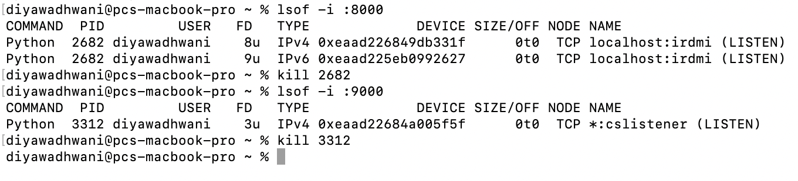

# LocalAuthSimulator
Explore the world of HTTP communication, authentication, and resource access through this Python-based simulation project. Simulate the interaction between a client, an Authorization Server, and a Resource API, gaining hands-on insights into the process of securing and retrieving data.

# HTTP Simulation Project

This is a Python project that simulates HTTP communication between a client, an Authorization Server, and a Resource API.

## Project Structure

The project structure 

python_project/
├── authorization_server.py
├── resource_api.py
├── main.py
└── test_server_interactions.py
└── requirements.txt

How to set up the project ?

Step 1) clone the github repo
Step 2) ensure you have python interpreter or venv (with python)
Step 3) get packages by following commands 
	pip install -r requirements.txt

To execute this project you need to activate all three components one by one

Step 1) open three terminals

Terminal 1: run below command
python authorization_server.py
Terminal 2: run below command
	python resource_api.py
Terminal 3: run below command
python main.py

(this is what output should look like)

After success execution of scripts you are execute unit test cases by following command

Step 2)
Open again a new terminal and run
	python -m unittest test_server_interactions.py

—-------------------------
In case you see errors while executing scripts related to ports already in use
You can kill the process running on ports and try to execute it again.

